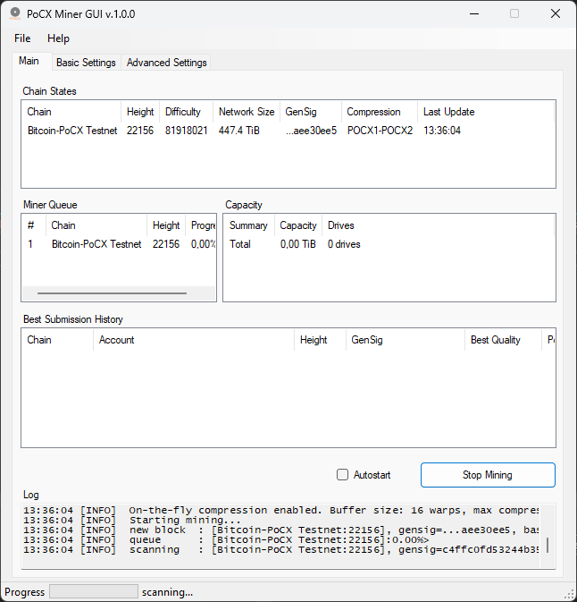
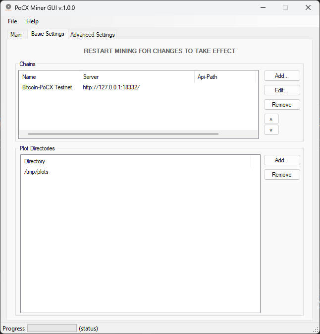
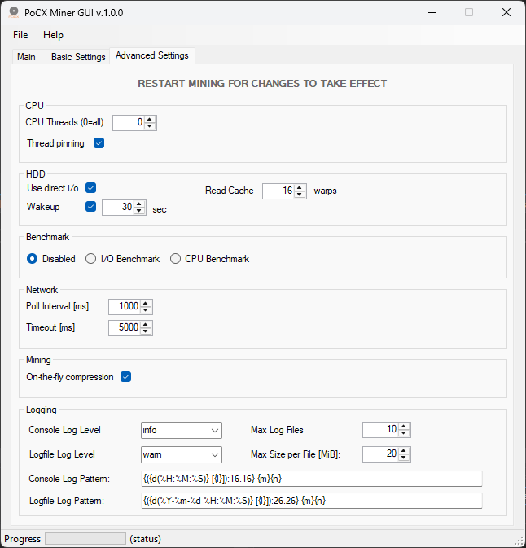
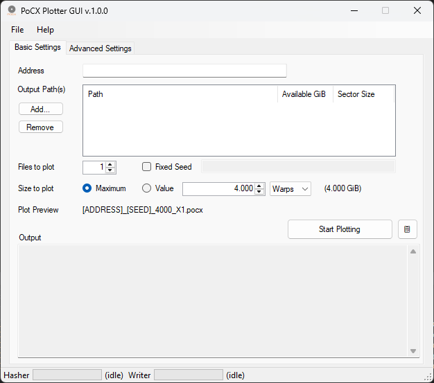
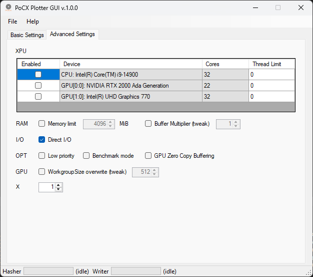

# PoCX Framework Windows GUI

Windows GUI applications for the [PoCX](https://github.com/PoC-Consortium/pocx) Proof-of-Capacity mining framework.

## Applications

- **PoCX Miner GUI** - Configure and monitor mining operations across multiple PoC blockchains
- **PoCX Plotter GUI** - Generate plot files using CPU or GPU acceleration

## Features

- Auto-download of PoCX executables from GitHub releases
- Real-time progress monitoring
- Multi-chain support (Miner)
- CPU and OpenCL GPU support (Plotter)
- Automatic update checking
- User-friendly configuration interface

## Screenshots

### Miner





### Plotter




## Requirements

- Windows 10 or later
- .NET Framework 4.7.2
- OpenCL runtime (for GPU plotting)

## Installation

Download the latest installer from [Releases](https://github.com/PoC-Consortium/pocx_win_gui/releases).

## Building from Source

### Requirements

- Visual Studio 2019 or later
- .NET Framework 4.7.2 SDK
- [Inno Setup 6](https://jrsoftware.org/isinfo.php) (for creating installer)

### Build

1. Open `PoCXWinGUI.sln` in Visual Studio
2. Restore NuGet packages
3. Build in Release configuration

### Create Installer

```powershell
.\build-release.ps1 -Version "1.0.0"
```

This will build the solution and create `installer/output/PoCXFrameworkGUI-1.0.0-Setup.exe`.

## License

MIT License - see [LICENSE](LICENSE)
